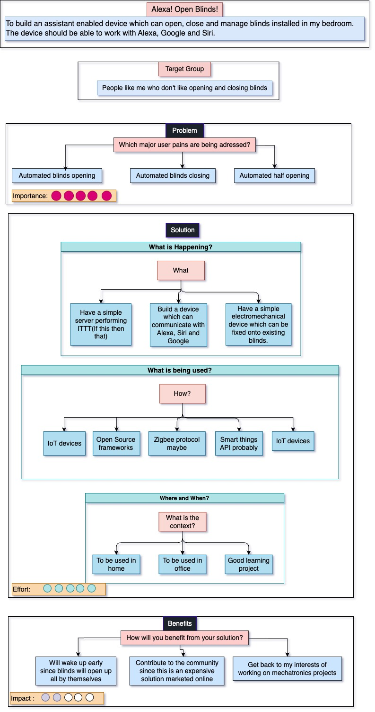

# Blinds Manager

To build an assistant enabled device which can open, close and manage blinds installed in my bedroom. The device should be able to work with Alexa, Google and Siri.

## Napkin Diagram of the project

Below outlines the goals, TODOs and target audience of the project at at the initiation phase.

